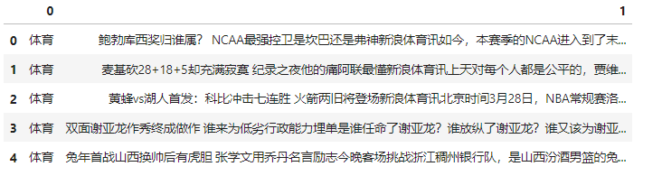
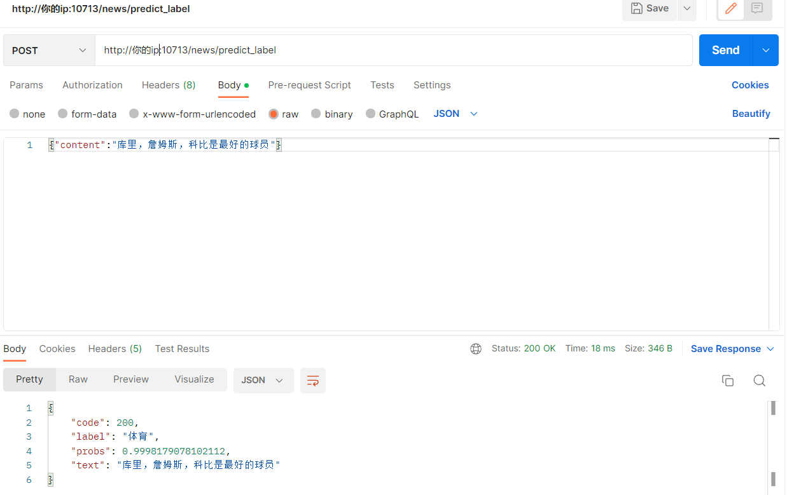
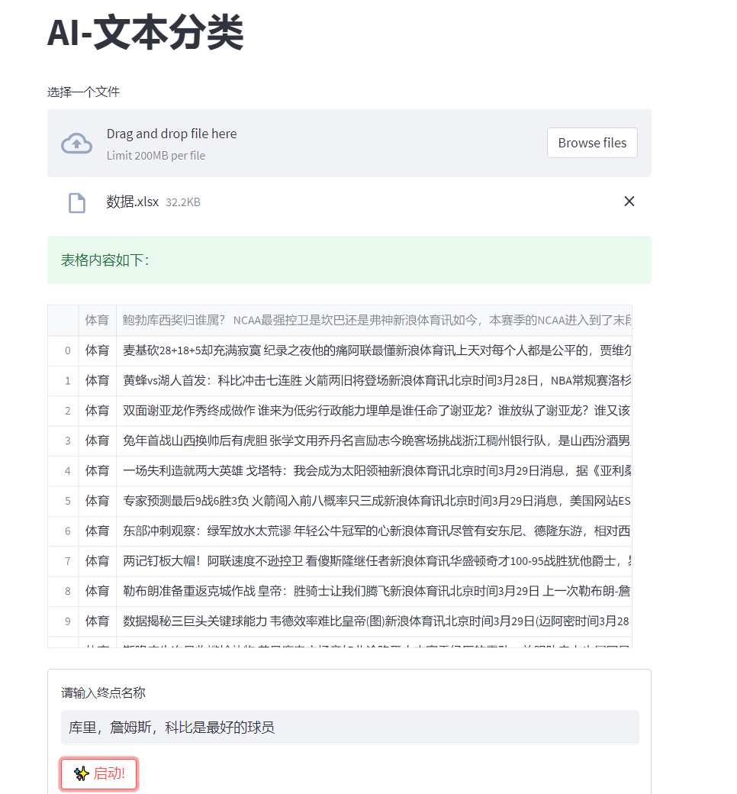
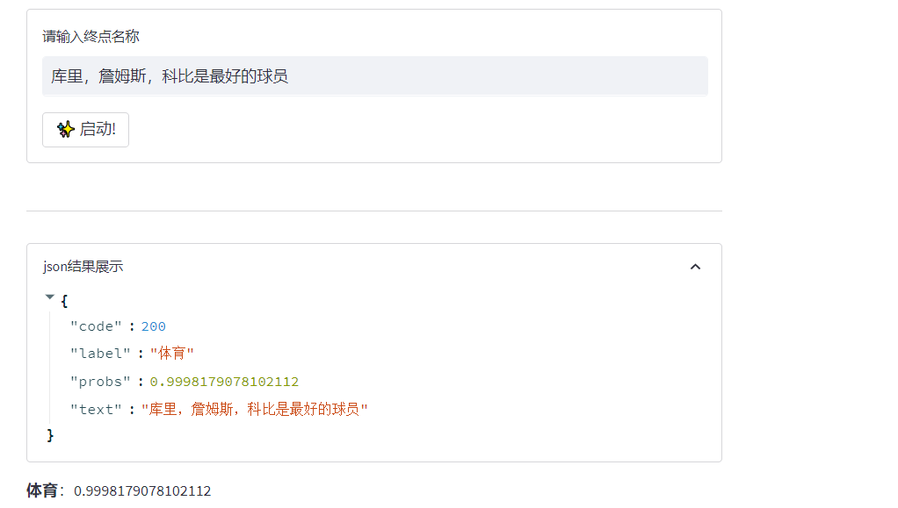

## 新闻文本分类
### 背景
使用开源的新闻数据集，做一个新闻文本分类的任务，主要是为了熟悉bert模型文本分类的流程，以及后期的部署和前端的展示。

### 数据形式
数据：一共10000条数据
类别：10个类别，分别是体育、财经、房产、家居、教育、科技、时尚、时政、游戏、娱乐



### 代码结构

```
├── best_models/best_bert.bin  # 训练好的分类模型
├── congfig.py/config.yaml     # 配置文件
├── labelencode/cnews.pkl      # 标签编码器(用于将数字转化为标签)
├── src/                       # 源代码
│   ├── bert_model.py/         # bert模型定义的脚步
│   ├── model_train.py         # 模型训练的脚步
    ├── train_data/            # 训练集
├── model_deploy.py            # 模型部署的脚步
├── show_demo.py               # 前端的脚步
```


### 项目启动

```
python model_deploy.py
```

```
streamlit run show_demo.py
```
### 接口说明
* 接口地址: http://ip:10713/news/predict_label
* 请求方式：POST
* 请求参数：
  * content: 需要分类的文本
* 返回结果：
  * code: 200表示成功，其他表示失败
  * label: 返回的标签
  * probs: 返回的标签的概率
  * text: 需要分类的文本


### 前端展示
* 前端展示地址：http://ip:8501



